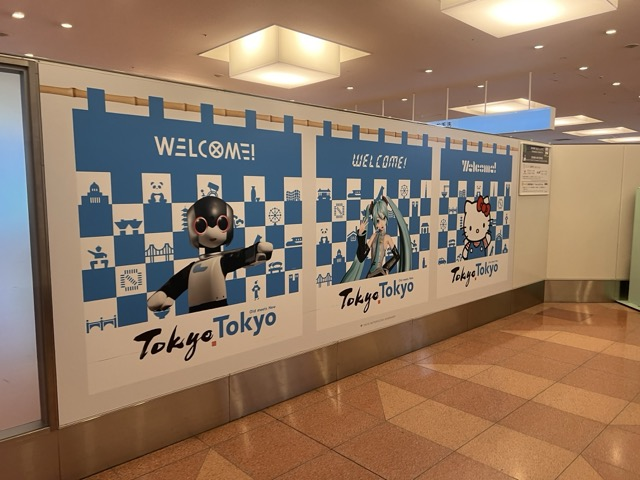
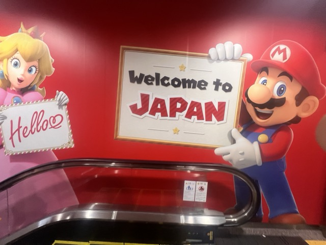
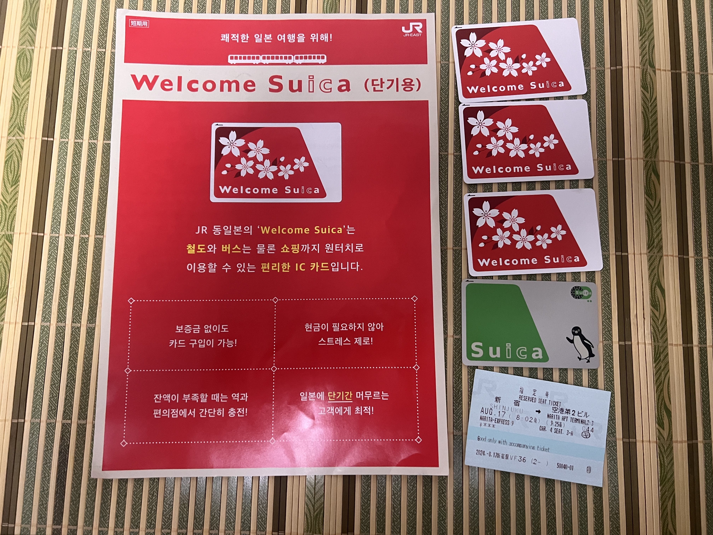
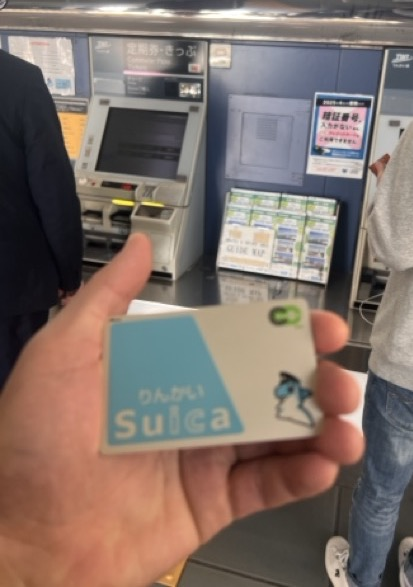

## 🇯🇵 일본 공항 입국 게이트 이야기

일본으로 올 때마다 느끼는 건데,  
공항마다 입국 게이트의 환영 문구와 마스코트가 꽤 다르다.

나리타로 들어가면 **슈퍼 마리오 캐릭터들이 ‘Welcome to Japan’**이라고 반겨준다.  
관광객 중심 공항이라 그런지, 확실히 테마가 뚜렷하다.

반면 하네다는 **‘Welcome to Tokyo’**가 메인이다.  
예전에는 입국장 안쪽 게이트에 **하츠네 미쿠, 헬로키티** 같은 캐릭터가 크게 붙어 있어서  
사진 찍기 좋은 스팟이 있었는데,  
요즘은 입국 동선이 바뀌어서 그쪽으로 거의 나오지 않는다.

그래서 나는 하네다로 입국할 때마다  
일부러 반대편 게이트로 돌아가서  
미쿠 사진 있는 곳을 한 번 찍고 나오곤 한다.  
아는 사람만 아는 스팟이라서 더 의미가 있다.

---

## 🚉 일본(도쿄)에 오면 제일 먼저 만나는 카드, Suica

공항을 빠져나오면 가장 먼저 부딪히는 게 **교통카드**다.  
일본은 지역마다 서로 다른 카드가 존재하지만,  
그중에서 가장 유명한 것이 Suica다.

물론 일본이 처음이면  
- 발권기 혹은 역창구에서 **종이 티켓**을 끊거나  
- 최근부터 지원하기 시작한 **신용카드 터치 결제(EMV tap-to-go)**  
  즉, **오픈루프 결제**로 이동하는 사람도 있다.

처음 한 두 번 정도는 이 방식도 괜찮다.  
하지만 일본 대중교통을 계속 이용하려면  
> **종이 티켓이나 오픈루프 결제만으로는 상당히 불편하다.**

노선마다 요금 체계가 다르고,  
갈아탈 때마다 결제해야 하고,  
신용카드의 경우 사용할 수 없는 경우도 많기 때문이다.

특히 종이 티켓의 경우 일본 철도 특유의 직결운행 노선을 잘못 타게되면 
개찰구 밖으로 그냥은 나갈 수 없는 불상사가 생길 수도 있다.

그래서 결국 대부분은  
**일본의 교통계 IC카드(Suica 등)**를 한 장 가지고 다니게 된다.

Suica는 JR East에서 만든 카드인데,  
종류가 생각보다 많다.

### ✔ 1) Welcome Suica (빨간색, 관광객용)

일회성 카드라 발급일로부터 28일의 사용 기간 제한이 있고,  
디자인이 빨간색 꽃문양으로 독특하다.  
외국인 전용이라 일본 거주자는 발급이 거의 불가능하다.
나리타, 하네다 공항의 입국장 주변에 발권기가 있다.
(나리타 : NEX/JR 탑승 개찰구 주변, 하네다 : 도쿄 모노레일 개찰구 주변)

조만간 디지털 패스로 전환된다는 카더라가 있기 때문에, 수집할 목적이 있다면 가급적 빨리 확보하도록 하자.

### ✔ 2) 일반 Suica (초록색)

가장 흔한 Suica.  
일본에서 생활하게되면 보통 이걸 쓰게 된다.

### ✔ 3) 오다이바 린카이 Suica (파란색)

오다이바를 연결하는 **린카이선(りんかい線)** 전용 발급 카드.  
파란색 디자인이 특징이고,  
아는 사람만 아는 지역 한정판이라 수집가들이 좋아한다.

### ✔ 4) 모노레일 Suica (회색 + 캐릭터 그림)

하네다 공항에서 도쿄 모노레일을 탈 때 만들 수 있는 Suica.  
회색 바탕에 모노레일 캐릭터 일러스트가 그려져 있다.  
옛날 버전은 **노란색**이라서 더 희귀함.

나같이 일본을 자주 오거나  
오타쿠 성향이 있는 사람은,  
이런 유니크한 Suica들을 자연스럽게 모으게 된다.

---

## 🎯 일본에는 ‘수집욕’을 자극하는 요소가 많다

Suica만 이런 게 아니라,  
일본은 전반적으로 **지역 한정판**, **기념 디자인**, **테마 컬래버레이션**이 많다.

몇 가지 예를 들면:

### ✔ 지역 한정 스탬프  
각 역, 유적지, 행사장에 가면 그 장소만의 스탬프가 있다.

### ✔ 지역 및 기간 한정 프리미엄 디저트(스위츠)  
도쿄 한정 / 홋카이도 한정 등, 지역, 기간, 장소별 한정 디저트, 간식 
편의점이나 자판기에서만 파는 맛도 많다.
홋카이도의 경우 일본에서 제일 밥이 맛있는 곳이라는 이야기가 있는 곳으로, 
종종 홋카이도 특산물을 전문으로 취급하는 곳도 보인다.

### ✔ 기념 IC카드, 기념 하루 승차권  
애니 콜라보, 이벤트 한정판 교통계 IC카드,
게임센터(오락실)에서 사용하는 어뮤즈먼트 IC 카드의 콜라보 및 이벤트 한정 디자인 등...  
종류가 너무 많아서 전부 모으는 건 불가능한 수준.

### ✔ 프리패스 티켓도 디자인이 다름  
지역 철도마다 종이 승차권 디자인이 다르고,  
어떤 곳은 아예 컬렉션 상품처럼 나온다.

일본에 살다 보면 이런 “작고 별거 아닌데 은근히 모으게 되는 것들”이 아주 많다.  
관광 입국할 때는 잘 모르는 문화인데,  
살다 보면 자연스럽게 체감하게 되는 부분이다.

---

## 🔚 마무리

이번에는 공항 입국 스팟 이야기와  
Suica 카드 종류에 대해 가볍게 정리해봤다.

특히 교통카드는 단순한 지불 수단을 넘어  
지역·시대·철도회사 색이 담긴 디자인이라  
오타쿠 관점에서는 꽤 흥미로운 수집 요소가 된다.

다음에 일본에 올 계획이 있다면  
Suica 디자인 한 번쯤 찾아보고,  
마음에 드는 걸로 발급받아 보는 것도 추천한다.

---