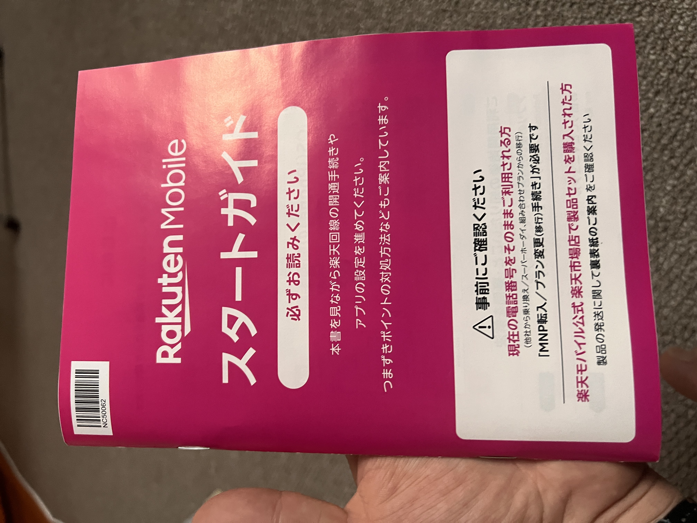

## 📱 일본 생활에 필수! 통신사 계약 & 전화번호 개통 가이드

일본에 입국한 직후, 가장 먼저 부딪히는 현실적인 문제 중 하나는 **휴대폰 개통**이다.  
은행 계좌 개설, 각종 행정 절차, 온라인 쇼핑, 심지어는 음식 배달 앱까지도 **전화번호 없이는 이용이 어렵다.**  
따라서 빠르게 전화번호를 확보하는 것이 중요하다.

---

## 🏢 일본의 주요 통신사 종류

일본에는 크게 **세 종류**의 통신사 형태가 있다.

### 1. 대형 통신사 (MNO / 3대 메이저)
- **SoftBank**
- **docomo**
- **au(KDDI)**

세 회사 모두 전국 커버리지가 매우 넓고, 매장 수가 많아 외국인이 개통하기 쉽다.  
다만 기본 요금이 **월 7,000엔 이상**으로 높은 편이다.

### 2. MNO 후발 주자 (Rakuten Mobile)
- **Rakuten Mobile**

초기에는 다른 대형 통신사 망을 빌려 서비스를 제공했지만,  
현재는 전국에 **자체 기지국**을 구축하여 독립 MNO로 운영되고 있다.  
다만 지방이나 실내에서는 여전히 커버리지 차이가 발생할 수 있다.

### 3. 저가형 통신사 (MVNO)
- **povo**
- **UQ mobile**
- **Y!mobile**
- **OCN**, **mineo** 등

대형 통신사의 망을 임대하여 운영하는 형태로  
요금은 저렴하지만, 지역·시간대에 따라 속도 저하가 발생할 수 있다.

---

## 📶 통신사별 특징 비교

| 통신사           | 월 요금 (기준)   | 데이터   | 특징 |
|----------------|-------------------|--------------|------------|
| SoftBank       | 약 7,000엔     | 무제한 | 전국 커버리지 우수, 매장 많음 |
| docomo         | 약 7,000엔     | 무제한 | 안정성 최고, 가격도 높음 |
| au             | 약 7,000엔     | 3/20GB/무제한 | 커버리지 우수, 요금은 비슷한 수준 |
| Rakuten Mobile | 1,078~3,278엔  | 무제한 | 무제한 데이터 가장 저렴, 일부 지역, 장소에서 신호 불안정 |
| ahamo          | 2,970엔        | 20GB   | docomo 온라인 전용 플랜, 외국인 개통 쉬움 |
| Y!mobile       | 2,178엔~       | 4GB~   | SoftBank 계열, 매장 많아 개통 용이 |
| UQ mobile      | 1,628엔~       | 3GB~   | au 망 사용, 외국인 개통 난이도 낮음 |
| povo           | 기본 0엔       | 토핑 구매 | 전화번호 유지에 적합, 6개월마다 유료 토핑 필요 |

---

## 📌 라쿠텐 모바일: 데이터 무제한 요금제가 가장 저렴하지만 주의할 점

필자는 **Rakuten Mobile**을 선택하였다.  
가장 큰 이유는 **무제한 데이터 요금제가 3,278엔으로 가장 저렴**했기 때문이다.  
또한 3GB, 20GB 구간을 기준 사용량 미달시 1,078엔, 2,178엔(세금포함)으로 사용한 만큼 지불하는 요금제와
막 체류하기 시작한 외국인도 **esim 개통이 가능**하여, 물리적인 유심 없이도 개통할 수 있다는 점이 매력적이었다.

하지만 단점도 존재한다.  
**일부 지역에서 신호가 약하거나 아예 잡히지 않는 경우**가 있었다.  
특히 지하철, 건물 내부, 지방 소도시 등에서는 **데이터 연결이 불안정**한 경우가 많았다.  
대도시에서도 군데군데 신호가 잘 안잡히는 곳이 많았고, 신호가 잡혀도 데이터가 안되는 경우가 있었다.

그러나 큰 문제는 없는게, 일본에서는 생각보다 **밖에서 데이터를 많이 사용하지 않는다.**  
대부분 집에서는 와이파이를 사용하고, 외출 시에는 간단한 검색이나 지도 확인 정도에 그친다.  
따라서 한 달 **20GB 이하의 데이터로도 충분**한 경우가 많다.

---

## ☎️ 데이터 외에 ‘전화 요금’도 주의할 점

한국과 달리, 일본은 아직까지 **전화 요금이 데이터와 별도로 과금**되는 경우가 많다.  
기본 요금제에 ‘무제한 통화’나 ‘기본 통화 제공’이 포함되지 않은 통신사도 적지 않다.

한국에서는 문자·통화가 대부분 기본 제공이지만,  
일본에서는 통화량이 많으면 **한국의 데이터 사용량처럼 초과 과금되는 구조**라고 보면 된다.

또한, 대형 통신사(docomo · au · SoftBank)와 일부 MVNO(UQ mobile, Y!mobile 등)에서는  
**‘5분 무료 통화’**, **‘10분 무료 통화’**, **‘단기 통화 무료 옵션(かけ放題ライト)’** 같은  
추가 유료 옵션을 제공하는 경우도 있다.  
기본 요금에는 포함되지 않지만, 전화량이 적은 사용자라면  
이런 단기 무료 통화 옵션을 조합해 비용을 아낄 수 있다.

---

### 📞 라쿠텐 모바일의 전화 정책 (Rakuten Link)

라쿠텐은 자사 앱인 **Rakuten Link**로 발신하는 경우에만 다음 혜택이 적용된다.

- **Rakuten Link → Rakuten Link**: 무료 무제한
- **Rakuten Link → 일반 회선(타 통신사 포함)**: 무료 통화 제공  
  (일반 전화 앱으로 걸면 무료 적용 안 됨)

즉, 라쿠텐을 사용할 경우 **반드시 Rakuten Link로 전화해야 무료 통화 혜택을 받을 수 있다.**
앱을 쓰지 않으면 통화료가 일반 MVNO 수준으로 부과되므로 주의가 필요하다.

---

## 📦 esim 개통 시 주의사항

라쿠텐 모바일은 esim으로도 개통이 가능하다.  
필자의 경우 온라인으로 신청했는데, 일반적으로는 **앱이나 이메일로 QR코드가 발송**되지만,  
라쿠텐은 **신청 후 약 1주일 뒤에 우편으로 안내장이 도착**했고,  
그 안에 **QR코드가 인쇄된 종이**가 동봉되어 있었다.

급하게 개통이 필요한 경우라면, 이 점을 반드시 확인 및 고려해야 한다.

---

## ☎️ 전화번호만 유지하고 싶다면? povo 추천

일본에서는 각종 행정 절차나 서비스 가입 시 **전화번호가 필수**인 경우가 많다.  
하지만 통신비를 아끼고 싶다면, **povo**가 좋은 선택이 될 수 있다.

- 기본 요금 **0엔**
- 전화번호만 유지 가능
- 필요할 때만 데이터나 통화 토핑 구매
- 단, **6개월에 한 번은 유료 토핑 구매 필수** (미구매 시 미사용으로 자동 해지됨)

예를 들어, 6개월에 한 번 **330엔짜리 데이터 1GB 토핑**만 구매해도  
전화번호를 계속 유지할 수 있다.  
**서브폰이나 인증용 번호**로 활용하기에 매우 유용하다.

---

## 🔄 au × 라쿠텐 모바일: 신규·전환 페이백 사례

지인에게 들은 사례로, au는 신규 가입자 확보보다 **가입자 수 유지**가 중요하고,  
라쿠텐 모바일은 **신규 가입자 수를 늘리는 것**이 중요한 구조라고 한다.

실제로 au 매장에서 신규 가입하려고 했을 당시 포인트 페이백 이벤트에 대해 문의했을 때,  
점원이 “바로 옆 라쿠텐 모바일에서 신규 가입 → 즉시 au로 이동하면 페이백 조건 충족”이라고 안내해  
그 자리에서 바로 절차가 진행되었다고 한다.

두 회사의 이해관계가 맞아떨어져 비교적 원활하게 처리된 케이스로,  
일본 통신사 간 이동에서는 이런 “즉시 이동 페이백” 방식이 의외로 흔하게 존재한다.

---

## 🌍 해외 로밍 데이터에 대해

일본의 대부분의 통신사는 해외 로밍 시 **별도의 사전 신청 없이 데이터 사용이 가능한 경우가 많다.**  
다만 통신사별로 제공 조건(무료 제공량, 속도 제한, 국가 제한 등)이 다르므로,  
해외 여행이나 출장을 자주 간다면 반드시 **각 통신사의 최신 로밍 정책을 확인**하는 것이 좋다.

특히 온라인 전용 플랜이나 저가형 MVNO의 경우,  
기본 로밍 제공이 없거나 유료 옵션만 제공하는 경우도 있기 때문에  
해외 사용 계획이 있다면 이 부분을 먼저 체크하는 것이 중요하다.

참고로 라쿠텐의 경우 매달 2GB의 로밍 데이터를 기본 제공한다.

---

## 🧊 마무리

일본에서 통신사 계약은 단순히 인터넷을 쓰기 위한 절차가 아니라,  
**생활 전반에 영향을 미치는 중요한 준비 과정**이다.

- 통신사 계약을 위해서는 **주소지 등록과 재류카드**가 필요하므로,  
  반드시 거처 확보 후 진행하는 것이 좋다.
- esim 개통은 편리하지만, **통신사마다 방식이 다르므로 사전 확인이 필수**이다.
- 데이터 사용량이 많지 않다면, **MVNO 통신사로도 충분히 생활 가능**하다.

다음 글에서는  
**은행 계좌 개설**, **운전면허 갱신/교환에 관한 기록**에 대해 다룰 예정이다.
