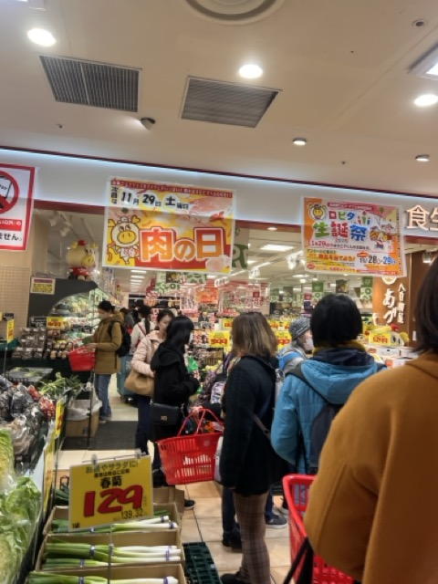
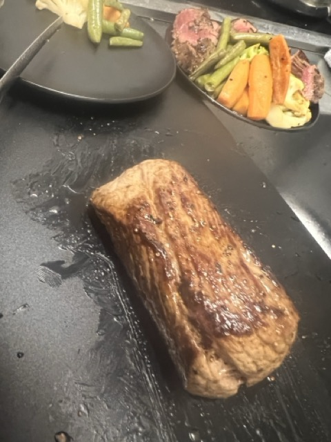

일본의 외식 물가가 싼 편이 아니기에,

슈퍼에서 장을 봐서 자취요리 하는 것이 보통이다.
같은 가격이면 직접 만드는게 더 양도 많고...

오늘도 다른날과 마찬가지로 슈퍼에 갔는데,

아... 벌써 29일인가, **고기의 날**이구나...

고기의 날은 한국의 삼겹살 데이와 비슷한 날 이라고 보면 될 듯 하다.

다른점은 **매달 29일**마다 돌아온다는 것

고기의 날은 평소보다 고기의 종류와 재고가 엄청 많고, 보통의 날 보다 아주 약간 더 싼 경향이 있다.

딱히 고기를 살 생각은 없었는데, 고기의 날이기도 하니 **스테이크**라도 해볼까 하고 소고기 한 덩어리를 집어 들어 집으로 향했다.

스테이크는 처음 구워봤지만 생각보다 빛깔이 괜찮게 나와서 놀랐다.

그런데... 뭔가 질기다. **힘줄**... 을 제거해야 했구나

스테이크를 잘 구워먹을 일이 없으니, **힘줄을 제거**해야 한다는 것을 차마 생각하지 못했다...

다음에 또 스테이크를 구워먹을 일이 있으면 그때는 힘줄이 있는지 체크를 해야겠다.

-끝-

---